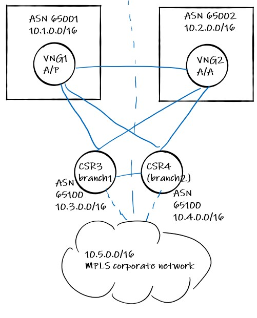

# Challenge 1: Lab Setup

**[Home](../README.md)** - [Next Challenge >](./02-enable_bgp.md)

## Description

Since this challenge is not about deploying VNets or NVAs, you can use a script to deploy the infrastructure that you will be working on. You can use these commands on a Linux system with the Azure CLI installed:

```bash
wget https://raw.githubusercontent.com/erjosito/azcli/master/bgp.sh
bash ./bgp.sh '1:vng1:65001,2:vng:65002,3:csr:65100,4:csr:65100,5:csr:65100' '1:2:nobgp,1:3:nobgp,1:4:nobgp,2:3:nobgp,2:4:nobgp,3:4:nobgp,3:5,4:5' fasthackbgp northeurope 'supersecretpsk'
```

The previous command will deploy the topology described in the following diagram without the BGP adjacencies (which you will configure as part of the challenge), including VPN Virtual Network Gateways in VNet 1 (in active/passive mode) and VNet 2 (in active-active mode). The script will take around 1h to run, during which time your coach will give you a theory intro on BGP



## Success Criteria

- Two VNGs and three Cisco CSRs deployed, each in its own VNet.
- IPsec tunnels created, BGP not configured (except for the onprem adjacencies between the CSRs)
- Students have explored the routing tables of the VNGs and at least one CSR

## Relevant Information

- [About BGP with Azure VPN Gateway](https://docs.microsoft.com/en-us/azure/vpn-gateway/vpn-gateway-bgp-overview)
- CLI commands for Virtual Network Gateways:
    - [Virtual Network Gateways - Get Bgp Peer Status](https://docs.microsoft.com/cli/azure/network/vnet-gateway?view=azure-cli-latest#az_network_vnet_gateway_list_bgp_peer_status)
    - [Virtual Network Gateways - List Advertised Routes](https://docs.microsoft.com/cli/azure/network/vnet-gateway?view=azure-cli-latest#az_network_vnet_gateway_list_advertised_routes)
    - [Virtual Network Gateways - List Learned Routes](https://docs.microsoft.com/cli/azure/network/vnet-gateway?view=azure-cli-latest#az_network_vnet_gateway_list_learned_routes)
- Powershell commands for Virtual Network Gateways:
    - [Virtual Network Gateways - Get Bgp Peer Status](https://docs.microsoft.com/powershell/module/az.network/get-azvirtualnetworkgatewaybgppeerstatus?view=azps-5.1.0)
    - [Virtual Network Gateways - List Advertised Routes](https://docs.microsoft.com/powershell/module/az.network/get-azvirtualnetworkgatewayadvertisedroute?view=azps-5.1.0)
    - [Virtual Network Gateways - List Learned Routes](https://docs.microsoft.com/powershell/module/az.network/get-azvirtualnetworkgatewaylearnedroute?view=azps-5.1.0)
- [Sample Cisco CSR configuration to connect to Azure](./csr/csr_config_2tunnels_tokenized.txt)
- [Script to deploy full BGP environment to Azure](https://github.com/erjosito/azcli/blob/master/bgp.sh)
