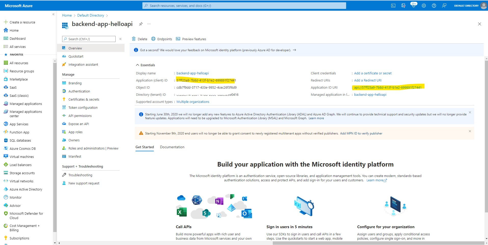
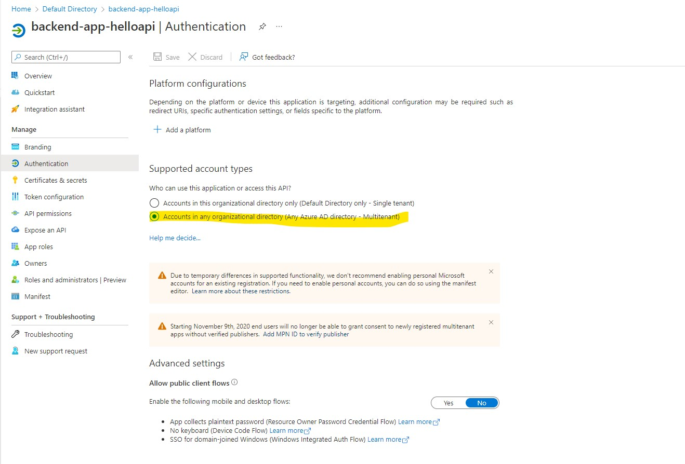
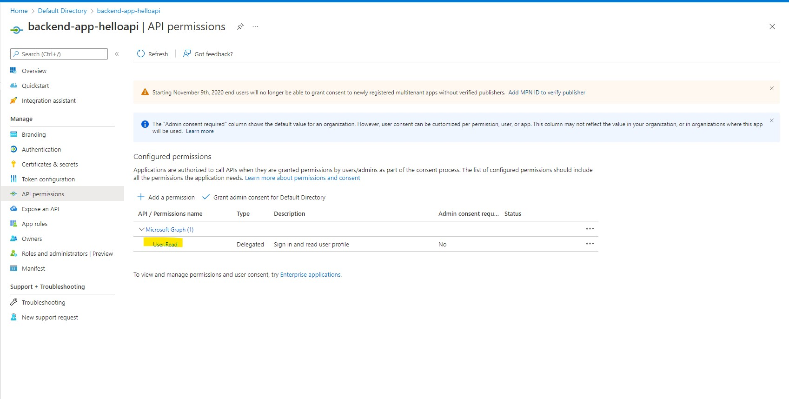

# Solution 04 - Securing backend API via OAuth

[<Previous Solution](./Solution-03.md) - **[Home](../readme.md)** - [Next Solution>](./Solution-05.md)

## Introduction

The students should be able configure OAuth2 authorization when calling Hello API.

## Description
- First, the student should follow the steps [Protect a web API backend in Azure API Management using OAuth 2.0 authorization with Azure Active Directory](https://docs.microsoft.com/en-us/azure/api-management/api-management-howto-protect-backend-with-aad).    
    - In Step [1. Register an application in Azure AD to represent the API](https://docs.microsoft.com/en-us/azure/api-management/api-management-howto-protect-backend-with-aad#1-register-an-application-in-azure-ad-to-represent-the-api), the backend-app AAD registration should look like below:
        
        
        
        
    - Next, in the "Add an identity provider" blade, configure the settings per below.  Click Add when done.
        
    - You will be redirected back to the Authentication page, now showing the authentication settings for your Function app.  Click AD application link (highlighted) to proceed to the next step.  Record the Application (client) ID of the API app for later.
        
    - You will now be redirected to the AD Application page.  Under the Manage section of the side menu, select Expose an API and find the Application ID URI. Record this value for later.
        
    - Click the scope link.  Student does not have to do anything here since the settings have already been pre-filled.  Though, they have the liberty to change any of these (e.g. Consent to Admins only), as long as the scope has been enabled.  
        

- Second, choose a client application, and for this example Postman will be used.  Follow the steps in [2. Register another application in Azure AD to represent a client application](https://docs.microsoft.com/en-us/azure/api-management/api-management-howto-protect-backend-with-aad#2-register-another-application-in-azure-ad-to-represent-a-client-application) 
    - In the Register an application page, configure the setings per below.  Click Register when done.
        
    -  You will now be redirected to the AD Application page.  Find the Application (client) ID value and record it later.  
    -  Create a client secret and note the key value which will be used in the next step.
         

- Third, follow the steps in [3. Grant permissions in Azure AD] (https://docs.microsoft.com/en-us/azure/api-management/api-management-howto-protect-backend-with-aad#3-grant-permissions-in-azure-ad) to grant permissions to allow the client app (Postman) to call the backend app (Hello API)
        
        

- [TODO: Will need to figure out if we get the token using client credentials or auth code flow] 
    In the fourth step [4. Enable OAuth 2.0 user authorization in the Developer Console](https://docs.microsoft.com/en-us/azure/api-management/api-management-howto-protect-backend-with-aad#4-enable-oauth-20-user-authorization-in-the-developer-console), you will slightly digress from the step in the sense that you will need to request for the client's AAD bearer token using Postman.
    
    (you will need to configure your client app to authenticate and get the AAD bearer token (which will be needed when you make calls to the secured Hello API) using [OAuth 2.0 authorization code grant](https://docs.microsoft.com/en-us/azure/active-directory/develop/v2-oauth2-auth-code-flow).)

    - If using Postman, just follow the steps in this [tip](https://docs.microsoft.com/en-us/azure/active-directory/develop/v2-oauth2-auth-code-flow#:~:text=Try%20executing%20this%20request%20and%20more%20in%20Postman%20--%20don't%20forget%20to%20replace%20tokens%20and%20IDs!).