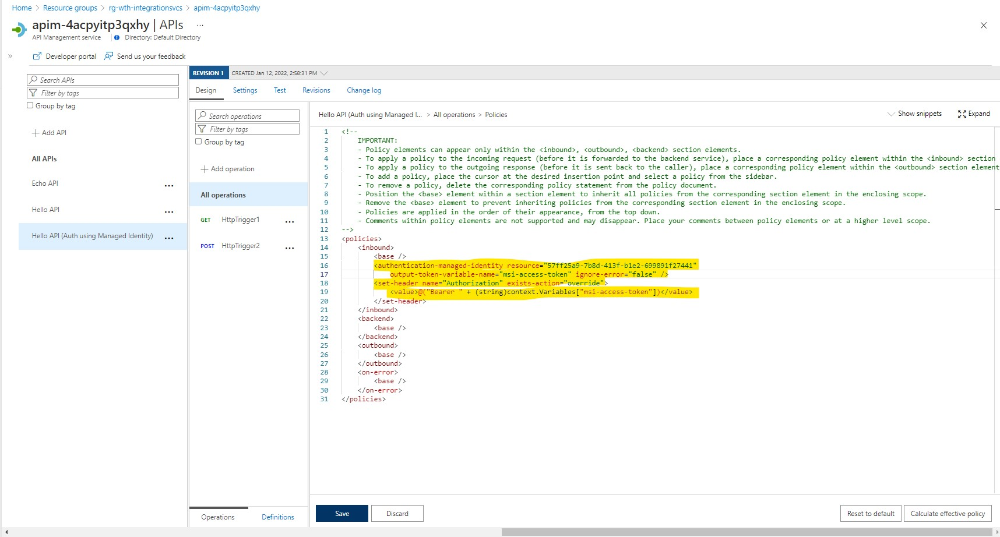

# Challenge 04 - Securing backends APIs

[<Previous Challenge](./Challenge-03.md) - **[Home](./README.md)** - [Next Challenge>](./Challenge-05.md)

## Pre-requisites

- You should have completed Challenge 03

## Introduction
You would like to be able to secure your backend APIs in one of the two ways:
- Secure Hello API in a private network
- Test end-to-end authorization to Hello API via OAuth.  

## Description
You should be able to either:
- Scenario 01: Configure secured backend APIs in a private network
- Scenario 02: Configure OAuth2 authorization when calling Hello API

## Success Criteria
For Scenario 01:
1. Create a new Function App in Elastic Premium plan which will be imported to APIM as Hello Internal API.  
1. The existing API - Hello API - will now become the public/external API.  The new path should configured in APIM as: https://apim-{{unique_id}}.azure-api.net/external/hello
1. Secure internal Hello Function App by enabling networking feature by either:
    - Only accepts traffic coming from the APIM subnet
    - Assigning a private endpoint to the Function App
1. Import the new Function App as Hello Internal API to APIM.  The new path should be: https://apim-{{unique_id}}.azure-api.net/internal/hello
1. Secure external Hello API so that it would only accept requests routed from Application Gateway.

For Scenario 02:
1. Configure OAuth 2.0 authorization in APIM 
    1. Register a client application (e.g. APIM Developer Portal or [Postman](https://www.postman.com/)) in Azure AD.  This will be used to make calls to Hello API via APIM.
    1. Configure JWT validation policy to pre-authorize requests to Hello API. 
    1. Register Hello API Function app as an AD application.
1. Call Hello API from your client application successfully.

## Learning Resources
Scenario 01:
- [Azure Functions networking options](https://docs.microsoft.com/en-us/azure/azure-functions/functions-networking-options)
  - [IP restriction list](https://docs.microsoft.com/en-us/azure/azure-functions/functions-networking-options#inbound-access-restrictions)
  - [Private endpoint](https://docs.microsoft.com/en-us/azure/azure-functions/functions-create-vnet)
- [API Management access restriction policies](https://docs.microsoft.com/en-us/azure/api-management/api-management-access-restriction-policies)
- [Rewrite URL with Azure Application Gateway - Azure portal](https://docs.microsoft.com/en-us/azure/application-gateway/rewrite-url-portal)
- [Protect APIs with Application Gateway and API Management](https://docs.microsoft.com/en-us/azure/architecture/reference-architectures/apis/protect-apis)

Scenario 02:
- [Protect a web API backend in Azure API Management using OAuth 2.0 authorization with Azure Active Directory](https://docs.microsoft.com/en-us/azure/api-management/api-management-howto-protect-backend-with-aad)
- [Protect API's using OAuth 2.0 in APIM](https://techcommunity.microsoft.com/t5/azure-paas-blog/protect-api-s-using-oauth-2-0-in-apim/ba-p/2309538)
- [Configure your App Service or Azure Functions app to use Azure AD login](https://docs.microsoft.com/en-us/azure/app-service/configure-authentication-provider-aad?toc=/azure/azure-functions/toc.json)
- [Calling an Azure AD secured API with Postman](https://dev.to/425show/calling-an-azure-ad-secured-api-with-postman-22co)
- [Postman - Authorizing requests](https://learning.postman.com/docs/sending-requests/authorization/)

## Tips 
For Scenario 01:
- Look into networking options for securing function apps, just use one or the other.
- To allow routes to external Hello API only, you should configure URL redirection mechanism in Application Gateway so that:
    - All calls to the AGW endpoint with the path /external/* (http://pip-{{unique_id}}.australiaeast.cloudapp.azure.com/external)  would go to https://api.{{unique_id}}.azure-api.net/external/hello
    - While calls to the default path http://pip-{{unique_id}}.australiaeast.cloudapp.azure.com/ returns HTTP 404.
- To secure APIM to only accept requests routed from Application Gateway, you may need to set-up a policy to filter traffic. 

For Scenario 02:
- Follow the steps in [Protect a web API backend in Azure API Management using OAuth 2.0 authorization with Azure Active Directory](https://docs.microsoft.com/en-us/azure/api-management/api-management-howto-protect-backend-with-aad), and use the APIM Developer portal as your client app.
- If using Postman as your client application, you need to [specifiying the Authorization details using OAuth2](https://learning.postman.com/docs/sending-requests/authorization/#oauth-20) which will ask you to log in and consent before sending the generated Access Token.  Ensure that you specify Authorization Code as the grant type.
    - Token Name: The name you want to use for the token.
    - Grant Type: A dropdown list of options. Choose Authorization code.
    - Callback URL: The client application callback URL redirected to after auth, and that should be registered with the API provider. If not provided, Postman will use a default empty URL and attempt to extract the code or access token from it. If this does not work for your API, you can use the following URL: https://oauth.pstmn.io/v1/browser-callback, but you need to add this to the list of Redirect URLs for your client-app AAD registration.
        - Authorize using browser: You can enter your credentials in your web browser, instead of the pop-up that appears in Postman by default when you use the Authorization code or Implicit grant type. Checking this box will set the Callback URL to return to Postman. If you opt to authorize using the browser, make sure pop-ups are disabled for the callback URL, otherwise it won't work.
    - Auth URL: The endpoint for the API provider authorization server, to retrieve the auth code. (e.g. https://login.microsoftonline.com/organizations/oauth2/v2.0/authorize for multi-tenant AAD account authentication)
    - Access Token URL: The provider's authentication server, to exchange an authorization code for an access token. (e.g. https://login.microsoftonline.com/organizations/oauth2/v2.0/token for multi-tenant AAD account authentication)
    - Client ID: The ID for your client application registered with the API provider. (e.g. the Application ID of the client app AAD registration created [earlier](https://docs.microsoft.com/en-us/azure/api-management/api-management-howto-protect-backend-with-aad#2-register-another-application-in-azure-ad-to-represent-a-client-application#:~:text=On%20the%20app%20Overview%20page%2C%20find%20the%20Application%20(client)%20ID%20value%20and%20record%20it%20for%20later.))
    - Client Secret: The client secret given to you by the API provider. (e.g. the Client secret of the client app AAD registration created [earlier](https://docs.microsoft.com/en-us/azure/api-management/api-management-howto-protect-backend-with-aad#2-register-another-application-in-azure-ad-to-represent-a-client-application##:~:text=Create%20a%20client%20secret%20for%20this%20application%20to%20use%20in%20a%20subsequent%20step.))
    - Scope: The scope of access you are requesting, which may include multiple space-separated values. (e.g. This is the [backend app scope](https://docs.microsoft.com/en-us/azure/api-management/api-management-howto-protect-backend-with-aad#2-register-another-application-in-azure-ad-to-represent-a-client-application###:~:text=Use%20the%20back-end%20app%20scope%20you%20created%20in%20the%20Default%20scope%20field) granted to the client app)
    - State: An opaque value to prevent cross-site request forgery. 
    - Client Authentication: A dropdown list: send a Basic Auth request in the header, or client credentials in the request body. After upgrading to a new  version, change the value in this dropdown menu to avoid problems with client authentication.

## Advanced Challenges
Scenario 02:
- You can try to do end-to-end AAD authentication by either:
    - Configuring your Function App to use AAD login. Use the [existing backend app AAD registration](https://docs.microsoft.com/en-us/azure/app-service/configure-authentication-provider-aad?toc=/azure/azure-functions/toc.json#-option-2-use-an-existing-registration-created-separately) created earlier.
    

    For the issuer URL, usually this would be the AAD Tenant where you created the backend app registration.  However, to be sure, I suggest that you check the issuer claim of the Access Token by decoding it using [jwt.io](https://jwt.io/).
    - Enable [Managed Identities in APIM](https://docs.microsoft.com/en-us/azure/api-management/api-management-howto-use-managed-service-identity) and then authenticate to backend using that identity using [authentication-managed-identity](https://docs.microsoft.com/en-us/azure/api-management/api-management-howto-use-managed-service-identity#authenticate-to-the-back-end-by-using-a-user-assigned-identity) policy.
     

[Back to Top](#challenge-04---securing-backends-apis)