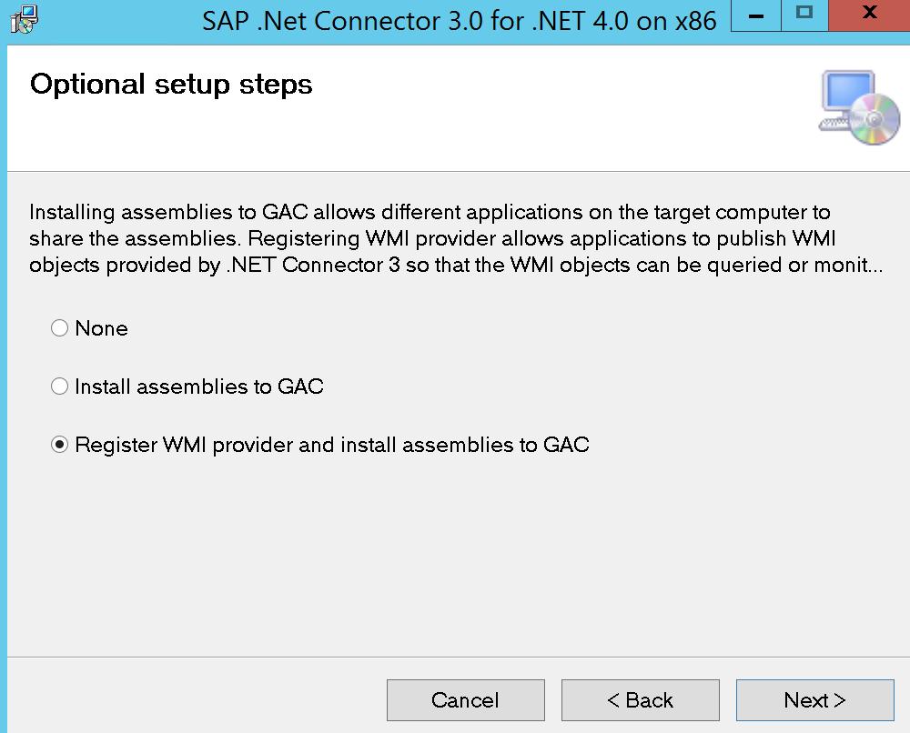
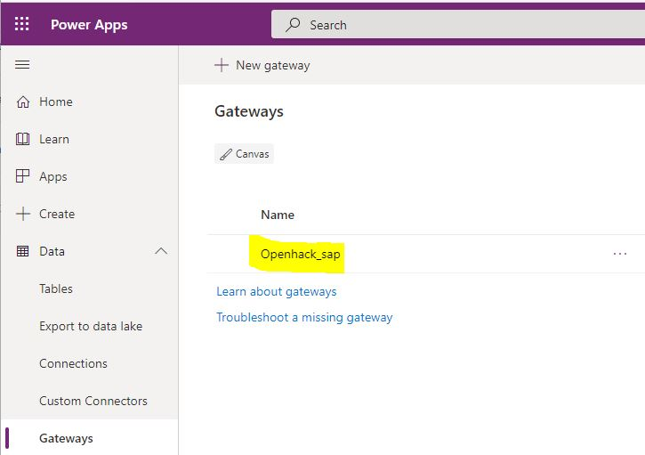
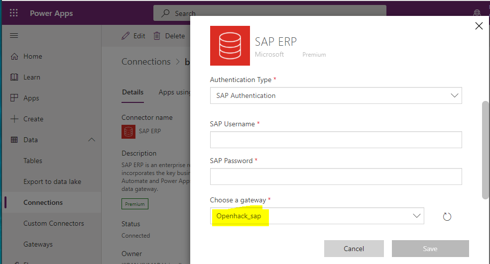
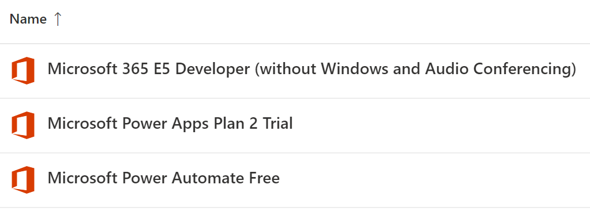
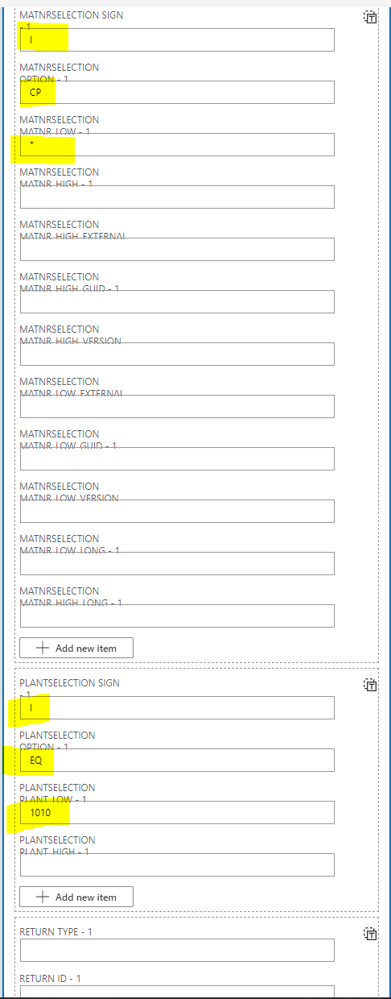
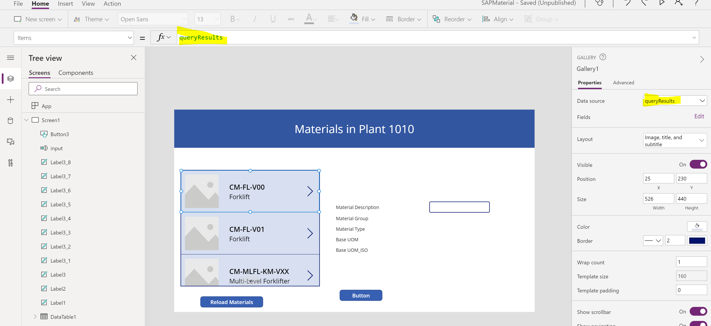
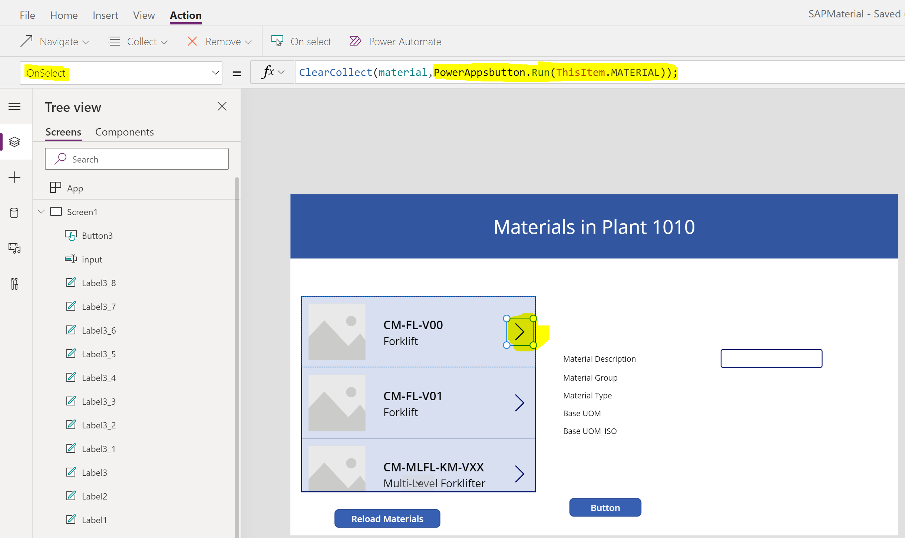
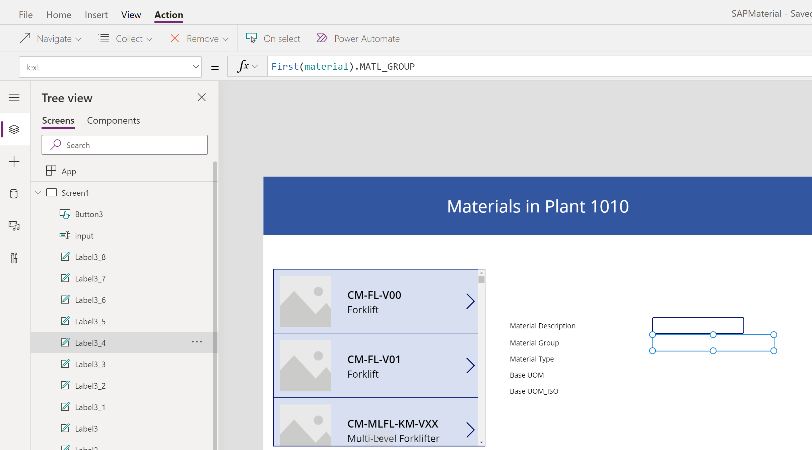

# Challenge 5: Build Mobile Application around SAP.

[< Previous Challenge](./04-Business-Continuity-and-DR.md) - **[Home](README.md)** - [Next Challenge >](./06-Start-Stop-Automation.md)

## Notes & Guidance

## Step 1 - **Build infrastructure**

- Make sure that fully activated SAP S/4 Hana system is installed. User name and password are working in SAP business client.
- Select a VM to install On-premise data gateway that can access SAP S/4 Hana system on dispatcher and gateway ports. Typical port ranges are 33**,32**,36**.
- Make sure correct on-premise data gateway and SAP .Net connectors are installed. Both should be of same platform type. (Either X64 / X86, mixing will not work. In doubt install SAP .Net connector for both X86 and X64 and restart on-premise data gateway).
- Make sure you are installing correct SAP .Net version and correct platform.
- 
- Register the on-premise datagateway with correct user and make sure that user can see connector in power platform at https://make.powerapps.com under gateways. If this is not visible, power application cannot communicate with SAP system. 
-
- Create SAP connection using registered data gateway and correct username and password.
- 

## Step 2 - **Develop power automate (flows)**

- Make sure user enabled Microsoft power Apps Plan2 Trail and Microsoft Power Automate Free. E5 developer is also preferred. 

**Getting Material list from SAP**

- Create power automate (flow) with name Get_SAP_MaterialList (note: Name can be anything). Insert steps PowerApps, Call SAP Function and response as shown below: Note that SAP ERP connection can be created from Flow as well by selecting the registered on-premise gateway. Student/Participant might have created the connection in advance. In that case, he has to use the existing connection. 
- 
- Input SAP system details in call SAP function step along with BAPI Name and its import parameters. See below screenshot.
- 
- 
- 
- Highlighted input details in the above screenshots are required fields for the BAPI_MATERIAL_GETLIST and can be customized as per requirement. Plant and sales organization numbers can be any existing numbers in SAP system.  <b> In the response, select MATNRLIST. Framing response is little critical. Follow steps mentioned under "Using the connector in an App" at https://powerapps.microsoft.com/en-us/blog/introducing-the-sap-erp-connector/. </b> 

**Getting Material information from SAP**

- Create power automate (flow) with name Get_SAP_Material (note: Name can be anything). 
- <b>Note that this step requires input from power application which is not yet ready.</b> 
- Create the flow and come back later to complete. 
- Insert 3 steps in PowerApps as similar to earlier but with different SAP BAPI. Flow may look like below:

- 
- 
- 

## Step 3 - **Build Power Application**

- Create power application with tablet layout. Sample screen can look like as shown below:
- 
- Create collection object to store loaded material list from SAP while this application is loading. Click on screen, select onvisible propery and connect it to power automate (flow) named "Get_SAP_Materiallist". To do this, click on menu item Action select power automate. Now select the flow Get_SAP_Materiallist. 
- 
- Adjust the onvisible property of screen as shown in below screenshot. Below Screen shot has different flow name, please ignore it and use correct flow name. Screenshot is given to show the property "OnVisible" and collection object "QueryResults".
- 
- Insert vertical gallery and connect it to collection object "QueryResults", which was pre-loaded while screen is being loaded.
- 	
- Create second collection object to store individual material details upon selection in the gallery. Click on select icon on gallery and adjust onselect property to call second flow Get_SAP_Material and store in collection object for example material. User power automate button under menu item Action to connect to the flow. Select the flow (Get_SAP_Material)  that get material details from SAP. Below screen shot has flow named powerappsbutton that should be replaced with the one that you created.
- 	
- Create few labels to show material information. Material has several attributes, insert labels based on number of fields you want to display. Above screen shot has total 10 labels - 5 for descriptions, 5 for actual values. Select the label and connect it with the corresponding attribute on the collection object as shown in below screen shot.Note that labels are not only the option to display information. Participant may choose text boxes or form which is absolutely fine.
- 	
