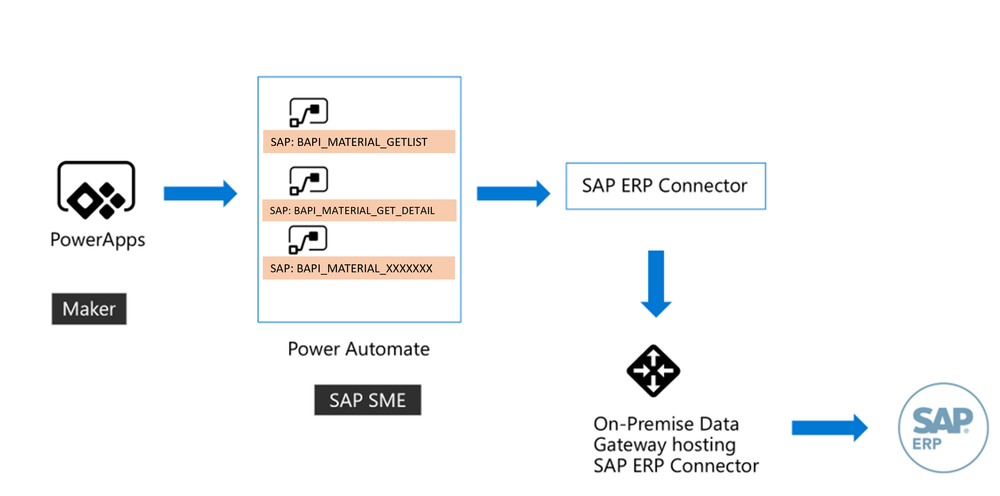

# Challenge 5: Build Mobile Application around SAP. 

[< Previous Challenge](./04-k8sdeployment.md) - **[Home](../README.md)** - [Next Challenge >](./06-deploymongo.md)

## Introduction

Mango Inc has established SAP landscape for several years. Now Mango Inc wants to enable users with simplified mobile user interface that requires data from multiple sources and one of the data source is S/4 Hana system. Assume that production workers on site want to know material information on their mobile devices. How do you build mobile application using No/Low code platform that can interact with SAP system seemlessly? In this challenge, we'll find that out.

## Description

Build a simple power application for Tablet that can  fetch available materials from the user sales organization and plant. Application should also allow user to select material from the list and display complete details for that material upon selection. High level architecture for this application may look like as shown below. 

This challenge requires you to build foundational infrastructure along with power application. 

## Success Criteria

1. Setup working ERP connection in the power automate (or flow).
2. Run the power application and display selected material information. 

## Hints

- BAPI Names to fetch data from **SAP S/4 Hana system**.
	- Materials list can be fetched from SAP system using BAPI named "BAPI_MATERIAL_GETLIST".
		- You can use below selection criteria to fetch materials using above BAPI.
		- Material selection: I CP * (like MATNRSELECTION SIGN as I, MATNRSELECTION OPTION as CP, and MATNRSELECTION MATNR LOW as *)
		- Plant selection: I EQ 1010
		- Sales organization selectionL I EQ 1010
		- You can leave rest of the selection criteria empty. 
		- MATNRLIST in the received outfrom SAP system has list of materials. 
	- Material information can be fetched from SAP system using BAPI named "BAPI_MTERIAL_GET_DETAIL"

- Power Automate is very useful to connect SAP system and fetch data. 
- Request & Response step can be used to pass information from power automate (flow) to power application. 

## References

1. SAP ERP Connector in power applications: https://powerapps.microsoft.com/en-us/blog/introducing-the-sap-erp-connector/
2. Power Apps canvas applications: https://docs.microsoft.com/en-us/powerapps/maker/canvas-apps/ 
3. Create collection object in power apps: https://docs.microsoft.com/en-us/powerapps/maker/canvas-apps/create-update-collection 
4. Using power (flows) Automate in power apps: https://docs.microsoft.com/en-us/powerapps/maker/canvas-apps/using-logic-flows

In this challenge we will cover scale and resiliency from multiple aspects. We'll make sure enough replicas of our container are running to handle load. We'll make sure that there are enough resources in our cluster to handle all the containers we want to run and we'll figure out how Kubernetes repairs itself.

- Scale the nodes in the AKS cluster from 3 to 1.  Make sure you watch the pods after you perform the scale operation.  You can use an Azure CLI command like the following to do this:

**`az aks nodepool scale --resource-group wth-rg01-poc --cluster-name wth-aks01-poc --name nodepool1 --node-count 1`**

- Scale the **Web** app to 2 instances
	- This should be done by modifying the YAML file for the Web app and re-deploying it 
- Scale the **API** app to 4 instances using the same technique as above.  
- Watch events using kubectl with its special watch option (the docs are your friend!).
	- You will find an error occurs because the cluster does not have enough resources to support that many instances.
	- There are three ways to fix this: increase the size of your cluster, decrease the resources needed by the deployments or deploy the cluster autoscaler to your cluster.  
- To fully deploy the application, you will need 4 instances of the API app running and 2 instances of the Web app. 
	- Hint: If you fixed the issue above correctly (look at pod resource request!), you should be able to do this with the resources of your original cluster.
- When your cluster is fully deployed, browse to the “/stats.html” page of the web application.
	- Keep refreshing to see the API app’s host name keep changing between the deployed instances.
- Scale the API app back down to 1, and immediately keep refreshing the `/stats.html` page.
	- You will notice that without any downtime it now directs traffic only to the single instance left.

